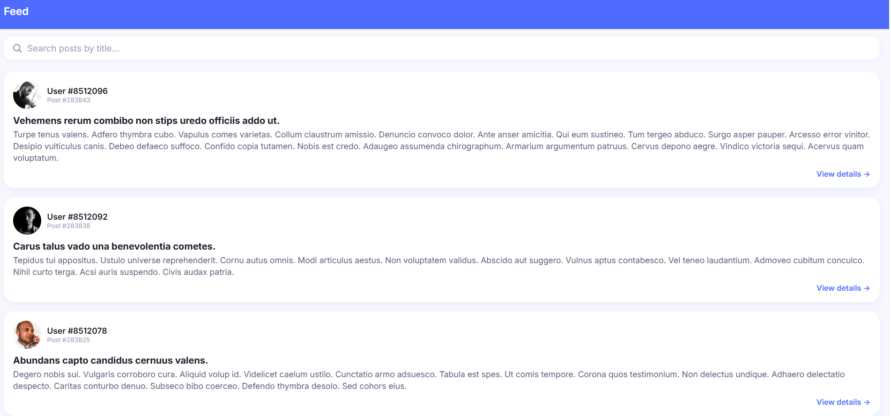
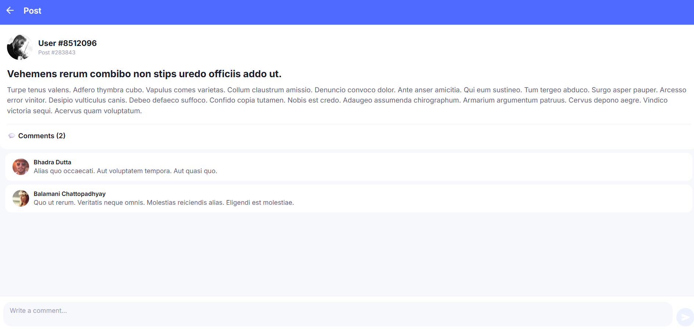

# Social App — React Native (Expo)

A sample social mobile app built with React Native and Expo, showing a feed of posts and their comments using the [GoREST](https://gorest.co.in/) public API.

## Features

- Home screen: scrollable feed of posts with a search bar to filter by title, and pull-to-refresh
- Post Details screen: full post content, list of comments, and a comment composer to add a comment locally
- Custom avatars generated per user (via pravatar.cc), since the GoREST API doesn't provide real avatar images
- TypeScript throughout for type safety
- Custom theme (colors + Inter font family) for consistent styling

## Tech Stack

- React Native + Expo (SDK 56)
- TypeScript
- React Navigation (native stack)
- GoREST public API (`https://gorest.co.in/public/v2`)

## Project Structure

src/
screens/        → Home and PostDetails screens
components/      → PostCard, CommentCard, Avatar
services/        → API calls (fetch posts/comments)
types/           → TypeScript interfaces (Post, Comment)
navigation/      → React Navigation stack setup
theme/           → Shared colors and typography

## Screenshots

| Home Screen | Post Details |
|---|---|
|  |  |
